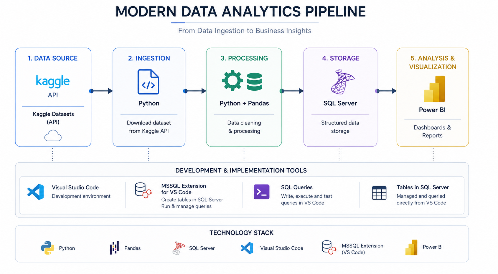
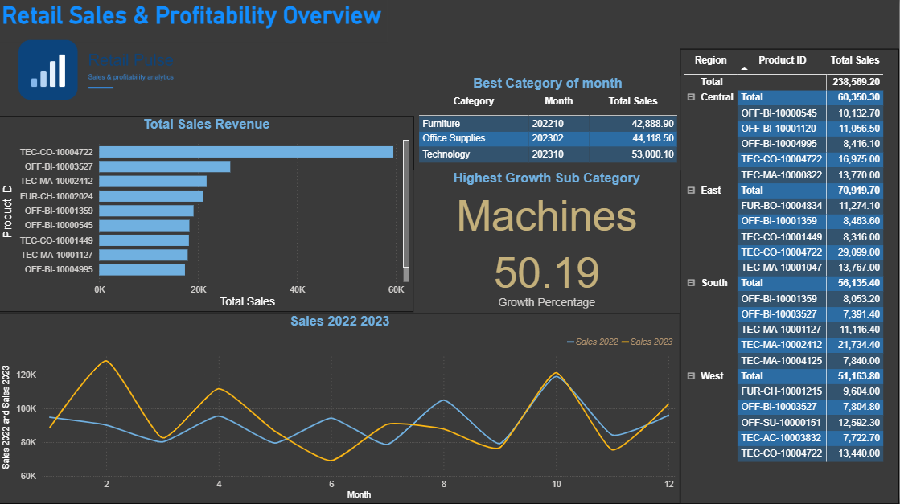

# E2E Analytics — Retail Orders Pipeline & Power BI Dashboard

## Introduction

This project is an end-to-end analytics pipeline built around a public retail orders dataset. It starts by pulling raw order data from Kaggle, cleans and enriches it in Python, loads it into a Microsoft SQL Server database, layers business-focused SQL views on top of it, and finally surfaces the results in an interactive Power BI dashboard.

The goal was to reproduce, hands-on, the full path a real analytics team follows: **ingest → transform → store → query → visualize** — using a modern, lightweight local toolchain (Python, VS Code, SQL Server, Power BI).

---

## Architecture



The pipeline has five stages:

1. **Data Source** — Kaggle Datasets API (`ankitbansal06/retail-orders`)
2. **Ingestion** — Python downloads the dataset via the Kaggle API
3. **Processing** — Python + pandas clean and enrich the raw data
4. **Storage** — the processed data is loaded into SQL Server
5. **Analysis & Visualization** — SQL views feed a Power BI dashboard

All development was done in **VS Code**, using the **MSSQL extension** to create tables, write/run/test SQL queries, and manage the database directly from the editor.

---

## Dashboard



The dashboard, **"Retail Sales & Profitability Overview,"** answers five business questions directly from SQL views (no DAX modeling required):

| Visual | Question it answers | Source view |
|---|---|---|
| Bar chart | Which products generate the most revenue? | `top_10_products` |
| Matrix | What are the top 5 products in each region? | `top_5_products_per_region` |
| Line chart | How do 2022 and 2023 sales compare month over month? | `month_over_month_growth` |
| Table | Which month was best for each category? | `best_month_per_category` |
| Cards | Which sub-category grew the most (profit, 2023 vs 2022)? | `highest_growth_sub_category` |

Build details for each visual are documented in [Resource/powerBI_visual_notes.txt](Resource/powerBI_visual_notes.txt), and the editable dashboard file is [Resource/PowerBI Dashboard.pbix](Resource/PowerBI%20Dashboard.pbix).

---

## What We Did

1. **Extract** ([src/pipeline/extract.py](src/pipeline/extract.py)) — downloaded `retail-orders.zip` from Kaggle and unzipped it into `DATA/orders.csv`.
2. **Transform** ([src/pipeline/transform.py](src/pipeline/transform.py)) — using an `OrderTransformer` chain:
   - Standardized column names (lowercase, underscores)
   - Cleaned invalid `ship_mode` values (`"Not Available"`, `"unknown"` → null)
   - Computed `discount` = `list_price × discount_percent / 100`
   - Computed `sale_price` = `list_price - discount`
   - Computed `profit` = `sale_price - cost_price`
   - Parsed `order_date` into a proper date type
   - Dropped the now-redundant source pricing columns
3. **Load** ([src/pipeline/load.py](src/pipeline/load.py)) — wrote the cleaned DataFrame into the `df_orders` table in SQL Server via SQLAlchemy.
4. **Analyze** ([sql/analysis.sql](sql/analysis.sql)) — wrote ad-hoc SQL to answer five business questions (top products, regional leaders, YoY trends, best month per category, highest-growth sub-category).
5. **Views** ([sql/views.sql](sql/views.sql)) — converted each analysis query into a reusable SQL `VIEW` so Power BI could connect directly without embedding logic in the report.
6. **Visualize** — connected Power BI to SQL Server, built one visual per view, and assembled them into a single dashboard.

---

## Tech Stack

| Layer | Technology |
|---|---|
| Language | Python 3.13 |
| Data Processing | pandas 3.0+ |
| Database | Microsoft SQL Server (local) |
| DB Connector | SQLAlchemy + pyodbc (ODBC Driver 17) |
| Data Source | Kaggle API |
| Package Manager | uv |
| Editor / DB tooling | VS Code + MSSQL extension |
| Visualization | Power BI Desktop |

---

## Step-by-Step Guide: Reproduce This From Scratch

### 1. Prepare your environment

- Install **Python 3.13**
- Install **[uv](https://docs.astral.sh/uv/)** (Python package manager)
- Install **Microsoft SQL Server** (Developer or Express edition works locally)
- Install the **ODBC Driver 17 for SQL Server**
- Install **VS Code**, then add the **MSSQL extension** (`ms-mssql.mssql`)
- Install **Power BI Desktop**
- Create a free **Kaggle account**

### 2. Get Kaggle API credentials

1. Go to [kaggle.com](https://www.kaggle.com) → your profile → **Account** → **Create New Token**
2. This downloads a `kaggle.json` file
3. Place it at:
   - Windows: `C:\Users\<YourUser>\.kaggle\kaggle.json`
   - Mac/Linux: `~/.kaggle/kaggle.json`

### 3. Clone the repository

```bash
git clone https://github.com/Mark-AI03/e2e_analytics.git
cd e2e_analytics
```

### 4. Install Python dependencies

```bash
uv sync
```

### 5. Set up the database

1. In VS Code, connect to your local SQL Server instance using the MSSQL extension
2. Create a database named `testdb`
3. Open [src/pipeline/config.py](src/pipeline/config.py) and update the connection string if your server name differs:
   ```python
   DB_CONNECTION_STRING = 'mssql://<SERVER_NAME>/testdb?driver=ODBC+DRIVER+17+FOR+SQL+SERVER'
   ```

### 6. Run the pipeline

```bash
uv run python src/main.py
```

This downloads the dataset from Kaggle, transforms it, and loads it into the `df_orders` table in SQL Server.

### 7. Run the analysis queries and create views

1. Open [sql/analysis.sql](sql/analysis.sql) in VS Code (MSSQL extension) to explore the business questions
2. Run [sql/views.sql](sql/views.sql) against `testdb` to create the five views:
   - `top_10_products`
   - `top_5_products_per_region`
   - `month_over_month_growth`
   - `best_month_per_category`
   - `highest_growth_sub_category`

### 8. Build the Power BI dashboard

1. Open Power BI Desktop → **Get Data** → **SQL Server**
2. Connect to your local server and `testdb` database
3. Import the five views listed above
4. Follow [Resource/powerBI_visual_notes.txt](Resource/powerBI_visual_notes.txt) to build each visual (bar chart, matrix, line chart, table, cards)
5. Or simply open [Resource/PowerBI Dashboard.pbix](Resource/PowerBI%20Dashboard.pbix) directly and point it at your local database

---

## Output Schema (`df_orders` table)

| Column | Description |
|---|---|
| order_id | Unique order identifier |
| order_date | Date of the order |
| ship_mode | Shipping method |
| segment | Customer segment |
| country / city / state / postal_code / region | Location info |
| category / sub_category / product_id | Product info |
| quantity | Units ordered |
| discount | Computed discount amount |
| sale_price | Final selling price |
| profit | Profit per order row |

---

## Data Source

- **Dataset:** [Retail Orders — ankitbansal06](https://www.kaggle.com/datasets/ankitbansal06/retail-orders)
- **Size:** ~9,994 order records (2022–2023)
- **License:** CC0 1.0 (Public Domain)
